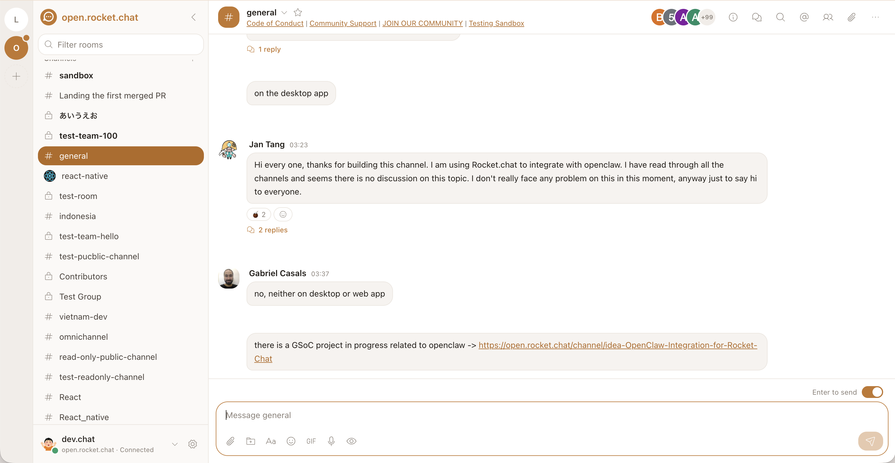

<p align="center">
  <picture>
    <source media="(prefers-color-scheme: dark)" srcset="docs/logo.png">
    <source media="(prefers-color-scheme: light)" srcset="docs/logo-light.png">
    
  </picture>
</p>

# Open Rocket.Chat Client

[English](README.md) · **Tiếng Việt** · [日本語](README.ja.md)

Một giao diện web độc lập do cộng đồng phát triển, dành cho các máy chủ tương thích với [Rocket.Chat](https://rocket.chat). Dự án dùng React 19, Vite và Tailwind, được đóng gói thành các tệp tĩnh nên có thể triển khai ở bất cứ đâu.

Dự án giúp bạn thực sự làm chủ giao diện mà người dùng sử dụng hằng ngày: giao diện được tách khỏi UI đi kèm Rocket.Chat, có phiên bản độc lập với máy chủ và cho phép kết nối nhiều máy chủ Rocket.Chat trong cùng một phiên đăng nhập.

> **Không trực thuộc, không được bảo trợ hay hỗ trợ bởi Rocket.Chat Technologies Corp.**
> Đây là một dự án cộng đồng. "Rocket.Chat" là thương hiệu của chủ sở hữu tương ứng và chỉ được dùng ở đây để mô tả tính tương thích.



Client kết nối qua [Open Rocket.Chat Gateway](https://github.com/zscontributor/open-rocket-chat-gateway). Gateway cung cấp một API ổn định ở phía trước máy chủ Rocket.Chat và không để token xác thực của Rocket.Chat lọt vào trình duyệt. Trang web chỉ giữ một cookie phiên `HttpOnly` không chứa thông tin mà JavaScript có thể đọc được.

## Vì sao dự án này tồn tại

[Z-SOFT](https://z-soft.com.vn) đang vận hành Rocket.Chat trong thực tế và quyết định mở mã nguồn client này vì những lý do dưới đây. Nếu bạn cũng triển khai Rocket.Chat cho một tổ chức hoặc cộng đồng, có thể bạn đã gặp những vấn đề tương tự.

**UI đi kèm Rocket.Chat không phải nền tảng thuận tiện để tuỳ biến lâu dài.** Frontend chính thức nằm trong monorepo của Rocket.Chat và gắn chặt với Meteor. Nếu muốn đổi _diện mạo_ — chẳng hạn gắn thương hiệu riêng, nhúng vào sản phẩm khác hoặc thiết kế lại bố cục — bạn phải làm việc với toàn bộ codebase và tự duy trì từng bản vá qua các lần nâng cấp. Dự án này tách riêng phần frontend thành một gói tĩnh: khoảng 400 kB sau gzip ở lần tải đầu và khoảng 580 kB sau khi tải thêm dữ liệu emoji cùng phần tô màu cú pháp. Không cần Meteor hay runtime phía máy chủ, và ranh giới API đã được ghi rõ để bạn có thể phát triển dựa trên đó.

**Nâng cấp máy chủ không nên buộc người dùng làm quen lại với giao diện.** Mỗi phiên bản Rocket.Chat mới thường thay đổi cả frontend đi kèm: vị trí màn hình, kiểu dáng thành phần và luồng thao tác đều có thể khác trước. Với một tổ chức đã đào tạo nhân viên, viết tài liệu theo ảnh chụp màn hình và áp dụng bộ nhận diện riêng, những thay đổi đó kéo theo một đợt hướng dẫn lại ngoài kế hoạch. Ở đây, UI có vòng đời phát hành riêng. Bạn có thể nâng cấp máy chủ Rocket.Chat để nhận bản vá bảo mật và tính năng mới, trong khi giao diện chỉ thay đổi khi _bạn_ chủ động cập nhật. [Gateway](https://github.com/zscontributor/open-rocket-chat-gateway) xử lý khác biệt giữa các phiên bản API của Rocket.Chat và cung cấp cho client một giao kèo có phiên bản rõ ràng, vì vậy các thay đổi phía Rocket.Chat không truyền thẳng tới trình duyệt.

**Nhiều máy chủ, chỉ cần đăng nhập một lần.** Phần lớn frontend Rocket.Chat chỉ phục vụ một máy chủ cho mỗi lần triển khai. Vì vậy, người phải làm việc đồng thời trên workspace công ty, máy chủ của khách hàng và máy chủ cộng đồng thường phải mở nhiều tab rồi đăng nhập lại mỗi khi chuyển nơi làm việc. Với client này, hỗ trợ nhiều máy chủ là một phần của kiến trúc: cùng một phiên duy trì kết nối tới tất cả máy chủ, bạn có thể chuyển qua lại ngay lập tức mà không cần xác thực lại, còn số tin chưa đọc và lượt nhắc tên vẫn được cập nhật ở những máy chủ đang không mở. Tất cả sự kiện đi qua một kết nối thời gian thực duy nhất. Đăng xuất khỏi một máy chủ cũng không ảnh hưởng tới các máy chủ còn lại. Chi tiết nằm ở mục [Kiến trúc mã nguồn](#kiến-trúc-mã-nguồn).

## Kiến trúc tổng thể

```
┌────────────────────────────────────────────────────────────────┐
│  Browser · apps/web                                            │
│  React 19 static bundle. Holds one opaque HttpOnly session     │
│  cookie — never a Rocket.Chat token.                           │
│                                                                │
│   ┌───┐  server rail     query cache            one WebSocket  │
│   │ A │◀── active        ['server', <id>, …]    for every      │
│   │ B │                                         server         │
│   └───┘                                                        │
└──────────────────────┬───────────────────────┬─────────────────┘
                       │                       │
             HTTPS /api/v1                 WSS /ws
      session cookie + X-Server-Id      session cookie
                       │                       │
                       ▼                       ▼
┌────────────────────────────────────────────────────────────────┐
│  Gateway · apps/gateway                                        │
│  NestJS + Fastify, a single Node process                       │
│                                                                │
│  session store — in memory, or Redis for more than one         │
│  instance:   cookie ──▶ { A: X-Auth-Token, B: X-Auth-Token }   │
│                                                                │
│  one upstream connection per session per server, shared by     │
│  every tab that session has open                               │
└────────┬───────────────────────┬───────────────────────┬───────┘
         │                       │                       │
   REST + DDP              REST + DDP              REST + DDP
  X-Auth-Token            X-Auth-Token            X-Auth-Token
         │                       │                       │
         ▼                       ▼                       ▼
┌─────────────────┐     ┌─────────────────┐     ┌─────────────────┐
│  Rocket.Chat A  │     │  Rocket.Chat B  │     │  Rocket.Chat …  │
│    + MongoDB    │     │    + MongoDB    │     │                 │
└─────────────────┘     └─────────────────┘     └─────────────────┘
```

Kiến trúc này mang lại bốn đặc điểm chính:

- **Token Rocket.Chat không bao giờ được gửi tới trình duyệt.** Trang web chỉ giữ một cookie mà JavaScript không thể đọc; gateway sẽ ánh xạ cookie đó với `X-Auth-Token` tương ứng của từng máy chủ. Ảnh và tệp đính kèm cũng được chuyển tiếp qua gateway vì thẻ `` không thể tự gửi kèm token.
- **Một phiên có thể chứa nhiều máy chủ.** Khi đăng nhập thêm bằng cùng cookie, máy chủ mới được _thêm vào_ phiên thay vì thay thế máy chủ cũ. Việc chuyển máy chủ chỉ đổi phạm vi dữ liệu ở phía client, không cần gửi yêu cầu vòng lại máy chủ hay đăng nhập lần nữa. Đăng xuất khỏi một máy chủ không làm gián đoạn các máy chủ còn lại.
- **Một WebSocket nhận sự kiện từ tất cả máy chủ.** Mỗi sự kiện có `serverId` và được đưa vào đúng vùng cache của máy chủ tương ứng. Nhờ vậy, số tin chưa đọc vẫn cập nhật ngay cả khi bạn đang xem máy chủ khác. Ở phía Rocket.Chat, mỗi cặp phiên và máy chủ chỉ dùng một kết nối chung cho mọi tab, nên mở năm tab vẫn chỉ tạo một kết nối thay vì năm.
- **Các server Rocket.Chat là bản triển khai bình thường, không sửa đổi.** Chúng không biết gì về nhau, cũng không biết gì về cách sắp xếp này. Đó cũng là lý do id của phòng chỉ duy nhất trong phạm vi một server, và vì sao mọi đường dẫn ở đây đều mang theo server.

## Hiện trạng

Đã chạy được.

**Đăng nhập và tài khoản**

- Đăng nhập bằng mật khẩu, có hỗ trợ xác thực hai lớp, hoặc qua các nhà cung cấp OAuth mà máy chủ đã bật. Các nút đăng nhập được tạo từ dữ liệu `auth/servers`, không viết cố định theo từng nhà cung cấp
- Phiên giữ ở phía server; đăng xuất khỏi một server hoặc toàn bộ server từ menu tài khoản
- Trạng thái hiện diện — trực tuyến, vắng mặt, bận, ẩn — và câu trạng thái, đặt riêng theo từng server
- Đổi ảnh của bạn, hoặc gỡ ảnh để quay về chữ cái đầu, riêng theo từng server

**Phòng**

- Kênh, nhóm riêng tư và tin nhắn trực tiếp trong cùng một sidebar, gom nhóm theo mục yêu thích, lọc theo tên bằng `⌘K` / `Ctrl+K`
- Tạo kênh hoặc nhóm, mở tin nhắn trực tiếp, sửa phòng, rời phòng, ẩn phòng, đánh dấu yêu thích, đánh dấu chưa đọc
- Đặt ảnh cho phòng — hiển thị ở sidebar và bảng thông tin phòng — hoặc gỡ ảnh đi
- Thanh ngữ cảnh: thông tin phòng, thành viên, thêm thành viên, thẻ người dùng, tệp tin, danh sách tin đã ghim / gắn sao / nhắc tên, luồng, tuỳ chọn thông báo theo từng phòng, dọn tin nhắn (prune), và bảng tra cứu phím tắt
- Tìm kiếm trong một phòng

**Tin nhắn**

- Cuộn ngược vô hạn qua lịch sử, phân cách theo ngày và gộp theo người gửi
- Gửi, sửa, xoá; Markdown, kèm thanh định dạng và phím tắt kiểu `⌘B` / `⌘I` / `⌘U`
- Thả cảm xúc emoji và bảng chọn emoji, bao gồm cả emoji tuỳ chỉnh của server
- Luồng, ghim và gắn sao
- Gợi ý tự động cho `@người-dùng`, `#kênh` và `/lệnh`; slash command được chạy trên server
- Tải tệp lên bằng kéo-thả hoặc từ khay đính kèm, lightbox xem ảnh, tìm kiếm GIF, và tin nhắn thoại — ghi âm xong được đưa vào khay, nghe lại được trước khi ai khác nghe thấy

**Thông báo và trạng thái chưa đọc**

- Thông báo trên máy tính, có bước xin quyền và âm báo. Client áp dụng cùng quy tắc với Rocket.Chat để quyết định khi nào cần thông báo, dựa trên trạng thái cửa sổ, phòng đang mở, trạng thái hiện diện và thiết lập của từng phòng
- Huy hiệu chưa đọc đếm _tất cả_ tin chưa đọc; lượt nhắc tên chỉ quyết định màu sắc. Đây cũng là cách Rocket.Chat tính, nên người có mười hai tin chưa đọc sẽ không chỉ thấy con số "1"
- Số tin chưa đọc và lượt nhắc tên vẫn được cập nhật trên những máy chủ bạn chưa mở

**Thời gian thực**

- Tin nhắn, chỉ báo đang gõ và trạng thái hiện diện qua một WebSocket, tự động kết nối lại kèm banner khi đường truyền suy giảm

**Giao diện, ngôn ngữ và mở rộng**

- Giao diện sáng, tối và theo hệ thống. Một theme là một object token thuần chứ không phải stylesheet — xem [docs/theming.md](docs/theming.md) và `@open-rocket-chat/theme`
- Tiếng Anh, tiếng Việt và tiếng Nhật — xem [docs/i18n.md](docs/i18n.md)
- Một plugin SDK (`@open-rocket-chat/plugin-sdk`) cho mục sidebar, hành động trên tin nhắn, hành động ở ô soạn tin và panel cài đặt

**Nhiều server**

- Nhiều server Rocket.Chat kết nối cùng lúc, có thanh chuyển server, badge chưa đọc riêng từng server, và không phải đăng nhập lần hai khi chuyển
- Liên kết sâu tới phòng (`/servers/:serverId/rooms/:roomId`)

Chưa làm: báo đã đọc, bản cài đặt được và chạy offline (web manifest cùng bộ icon đã có, nhưng chưa có service worker), và đóng gói desktop.
Chế độ kết nối thẳng tới Rocket.Chat thì hoàn toàn không nằm trong kế hoạch; lý do ở phần dưới.

### Chưa bao gồm Omnichannel

Phần **Omnichannel** (Livechat) dành cho nhân viên hỗ trợ khách hàng của Rocket.Chat hiện chưa được triển khai. Client chưa có hàng đợi, phân phối hoặc tiếp nhận cuộc trò chuyện, phòng ban, chuyển tiếp, câu trả lời mẫu, đóng cuộc trò chuyện kèm bản ghi, cũng như bảng thông tin khách truy cập và liên hệ. Widget trò chuyện dành cho khách gắn trên website là một sản phẩm riêng của Rocket.Chat và không thuộc phạm vi dự án.

Phần vẫn hoạt động, vì nó đi kèm cơ chế xử lý phòng thông thường: một phòng Omnichannel mà tài khoản đang đăng nhập đã tham gia vẫn hiện trong sidebar, vẫn đọc, gửi và thả cảm xúc như mọi phòng khác; các system message của Livechat — chat bắt đầu, kết thúc, được chuyển tiếp, tạm giữ, đã gửi bản ghi — hiển thị bằng nhãn tử tế thay vì tên sự kiện thô. Phần quản lý thành viên được ẩn đúng cho những phòng đó, vì phòng Omnichannel không có danh sách thành viên để quản lý.

Đây là một phần còn thiếu, không phải tính năng bị loại bỏ vĩnh viễn. Z-SOFT xây client cho nhu cầu trò chuyện nội bộ nên chưa từng cần đến Omnichannel; phát hành một màn hình hỗ trợ khách hàng chưa hoàn chỉnh sẽ không mang lại nhiều giá trị. **Nếu bạn cần tính năng này, hãy triển khai và gửi pull request.** Kiến trúc hiện tại đã chừa chỗ để mở rộng. Công việc nên bắt đầu từ [gateway](https://github.com/zscontributor/open-rocket-chat-gateway), vì gateway chưa cung cấp route Livechat nào: schema đặt trong `packages/api-contract`, phần chuẩn hoá ở `packages/rc-adapter`, còn route ở `apps/gateway`. Khi các phần đó hoàn tất, UI mới có API để sử dụng. [CONTRIBUTING.md](CONTRIBUTING.md) giải thích cách review thay đổi trải trên cả hai repository. Một phần nhỏ, hoàn chỉnh — chẳng hạn hàng đợi và thao tác nhận chat, còn chuyển tiếp làm sau — sẽ dễ được merge hơn một pull request cố triển khai toàn bộ sản phẩm cùng lúc.

## Bắt đầu nhanh

Bạn cần gateway và một server Rocket.Chat. Repository gateway có sẵn file Docker Compose cho phần server.

```bash
# 1. Rocket.Chat + MongoDB, rồi tới gateway (chạy trong checkout của gateway)
pnpm install && pnpm run build
pnpm run rc:up
cp apps/gateway/.env.example apps/gateway/.env
pnpm --filter @open-rocket-chat/gateway dev      # http://localhost:4000

# 2. Repository này
pnpm install
pnpm --filter @open-rocket-chat/web dev          # http://localhost:5173
```

Đăng nhập bằng `admin` / `admin-password-123` — tài khoản mà file Compose tạo sẵn.

Hai repository được phát triển song song. Thông qua cấu hình `link:` của pnpm, repo này lấy `@open-rocket-chat/api-contract` từ bản checkout nằm bên cạnh. Vì vậy, cho đến khi các package được phát hành lên npm, bạn cần đặt cả hai repo trong cùng một thư mục cha. Xem [CONTRIBUTING.md](CONTRIBUTING.md).

### Tìm kiếm GIF

Ô soạn tin có tìm kiếm [GIPHY](https://giphy.com/), cần một API key.
Lấy key miễn phí ở [GIPHY developer dashboard](https://developers.giphy.com/dashboard/), rồi chọn một trong hai cách

- đặt `VITE_GIPHY_API_KEY` trong `apps/web/.env`, để nó đi kèm bản build, hoặc
- dán vào **Settings → GIFs**, chỉ lưu trong trình duyệt đó.

Không có key thì mọi thứ khác vẫn chạy và nút GIF sẽ giải thích đang thiếu gì.
Ảnh GIF được chọn sẽ được tải về rồi upload vào phòng như một tệp đính kèm bình
thường, nên nó vẫn hiển thị ngay cả ở nơi đã tắt xem trước liên kết.

## Gateway là bắt buộc

Client này chỉ kết nối với Rocket.Chat thông qua gateway. Dự án không có chế độ
cho trình duyệt kết nối trực tiếp tới máy chủ Rocket.Chat; đây là lựa chọn có
chủ đích, không phải một tính năng còn thiếu.

REST API của Rocket.Chat xác thực bằng header `X-Auth-Token`. Trình duyệt nói
chuyện trực tiếp với nó buộc phải giữ token đó, mà token thì cho toàn quyền truy
cập tài khoản — đọc mọi phòng, đăng bài dưới danh nghĩa người dùng, sửa hồ sơ
của họ. Chỉ cần một lỗ hổng XSS trên trang hoặc trong bất kỳ thư viện phụ thuộc
nào, token có thể bị đánh cắp.

Khi đi qua gateway, trình duyệt chỉ giữ một cookie phiên mà JavaScript không thể
đọc. Bộ test Playwright kiểm tra điều này trong mỗi lần chạy:

```ts
expect(exposed.local).not.toMatch(/authToken|X-Auth-Token/i);
```

Nếu hỗ trợ cả kết nối trực tiếp lẫn kết nối qua gateway, bảo đảm trên sẽ không
còn đúng với tất cả người dùng. Dự án cũng phải duy trì hai cơ chế truyền dữ liệu
song song, trong khi mức độ an toàn lại phụ thuộc vào cách từng nơi cấu hình.
Gateway chỉ là một tiến trình Node, có sẵn Docker image và file Compose; yêu cầu
dùng gateway là một đánh đổi hợp lý để giữ nguyên cam kết bảo mật này.

Nếu bạn cần một triển khai tĩnh mà không muốn tự chạy backend, hãy chạy một
gateway dùng chung cho cả tổ chức rồi trỏ mọi client vào đó. Cách triển khai vẫn
đơn giản, còn token luôn nằm ở phía máy chủ.

## Xây dựng bản dùng cho môi trường thực tế

```bash
pnpm run build
```

`apps/web/dist` chứa các tệp tĩnh, có thể được phục vụ bằng Nginx, CDN hoặc bất kỳ dịch vụ lưu trữ web tĩnh nào. Môi trường chạy không cần Node.js.

Đặt `VITE_GATEWAY_URL` lúc build trỏ tới origin công khai của gateway. Nếu gateway nằm khác site với ứng dụng, nó còn phải chạy với `SESSION_COOKIE_SAMESITE=none` qua HTTPS và liệt kê origin của ứng dụng này trong `CORS_ORIGINS`. Triển khai cùng site thì không cần cả hai.

Khi phát triển, Vite proxy `/api` và `/ws` sang gateway, nhờ vậy session cookie ở cùng origin và bạn tránh được toàn bộ phần cấu hình đó.

## Kiến trúc mã nguồn

```
apps/web/
├── src/features/     auth, rooms, messages, notifications, realtime — mỗi domain một thư mục
├── src/ui/           các primitive trình bày (Radix + Tailwind)
├── src/stores/       Zustand: trạng thái UI và toast
├── src/i18n/         mỗi feature một namespace JSON, cho từng ngôn ngữ
└── src/lib/          instance SDK, query client, cache key và phần lưu trữ
packages/client-sdk/  các lời gọi gateway có kiểu và kênh realtime tự kết nối lại
packages/theme/       giao kèo theme, các theme đi kèm và cách áp dụng
packages/plugin-sdk/  các điểm mở rộng và registry của plugin
e2e/                  test Playwright chạy trên stack thật
```

**Trạng thái được phân chia có chủ đích.** Dữ liệu từ máy chủ — phòng, tin nhắn, hồ sơ — chỉ nằm trong TanStack Query. Các sự kiện thời gian thực cũng được cập nhật vào cùng cache, vì vậy component không cần biết dữ liệu đến từ HTTP hay WebSocket. Zustand chỉ giữ trạng thái thuần phía giao diện, như theme, bản nháp, luồng đang mở và người đang nhập. Cách phân chia này giúp tránh việc sao chép dữ liệu máy chủ sang Zustand rồi phải đồng bộ hai nơi.

**Định tuyến** hiện chỉ cần vài dòng dùng History API, chưa cần một thư viện router riêng. Với hai màn hình, thư viện router chưa mang lại nhiều lợi ích; có thể bổ sung khi xuất hiện các màn hình cài đặt và quản trị. Đường dẫn phải chứa máy chủ vì id Rocket.Chat chỉ duy nhất trong phạm vi một máy chủ. Khi kết nối nhiều máy chủ, `/rooms/:roomId` sẽ không đủ để xác định phòng; các liên kết cũ vẫn được mở theo máy chủ đang hoạt động.

**Hỗ trợ nhiều máy chủ được tổ chức theo phạm vi dữ liệu, không phải một chế độ bật/tắt.** Một phiên có thể giữ kết nối tới nhiều máy chủ Rocket.Chat. `<ServerScope>` gắn cây component bên dưới với một máy chủ; mỗi hook lấy client và cache key từ phạm vi đó thay vì nhận `serverId` qua tham số. Mọi cache key đều có dạng `['server', <id>, …]`, nên khi chuyển máy chủ, dữ liệu của máy chủ vừa rời vẫn được giữ nguyên. WebSocket thời gian thực được đặt _bên ngoài_ phạm vi này để nhận sự kiện của tất cả máy chủ. Mỗi sự kiện cho biết máy chủ nguồn và được cập nhật vào đúng cache, kể cả khi bạn đang xem máy chủ khác. Nhờ vậy, số tin chưa đọc luôn được cập nhật ở mọi nơi.

## Kiểm thử

```bash
pnpm run typecheck
pnpm run test         # unit test: giao kèo theme, tính đầy đủ của bản dịch, quy tắc thông báo, cách tính chưa đọc
pnpm run test:e2e     # Playwright, chạy trên stack đang bật
```

Unit test kiểm tra những quy tắc không cần đến trình duyệt: khi nào hiển thị thông báo, huy hiệu chưa đọc phải hiện số nào, các bản dịch có còn đủ khóa như bản tiếng Anh hay không và một theme có đáp ứng đúng giao kèo hay không.

Bộ Playwright chạy trên toàn bộ hệ thống — ứng dụng, gateway và một máy chủ Rocket.Chat thật — vì các lỗi dễ xuất hiện nhất thường nằm ở điểm kết nối giữa các phần, như thuộc tính cookie, quá trình nâng cấp WebSocket và nội dung media đi qua proxy. Bộ test cũng xác nhận rằng trang web không thể truy cập token Rocket.Chat và tin nhắn gửi trong một ngữ cảnh trình duyệt sẽ tới ngữ cảnh khác qua kênh thời gian thực.

**Bộ test này chỉ chạy ở máy bạn.** Dựng cả stack đó trên runner của GitHub tốn hơn hai mươi phút mỗi lần, nên CI chỉ lo format, lint, kiểu, build, unit test và rà soát dependency; phần Playwright để lại cho bạn. Hãy chạy nó trước khi mở pull request đụng tới những gì nó bao phủ.

## Dependencies và giấy phép

Các thư viện được dùng trực tiếp khi chạy ứng dụng và mục đích của từng thư viện được liệt kê bên dưới. Phiên bản cụ thể nằm trong `package.json`; bảng này cho biết bản phân phối chứa những gì và tuân theo giấy phép nào.

| Package                                           | Dùng để làm gì                                 | Giấy phép  |
| ------------------------------------------------- | ---------------------------------------------- | ---------- |
| `react` · `react-dom`                             | Runtime của giao diện                          | MIT        |
| `@tanstack/react-query` · `-persist-client`       | State phía server, và cache IndexedDB của nó   | MIT        |
| `@tanstack/react-virtual`                         | Ảo hoá danh sách tin nhắn và thành viên        | MIT        |
| `zustand`                                         | State thuộc về client: UI, toast               | MIT        |
| `@radix-ui/react-*`                               | Dialog, popover, menu, tooltip, switch có a11y | MIT        |
| `@phosphor-icons/react`                           | Bộ icon                                        | MIT        |
| `react-markdown` · `remark-gfm`                   | Render nội dung tin nhắn                       | MIT        |
| `emojibase-data`                                  | Dữ liệu emoji Unicode cho bảng chọn            | MIT        |
| `i18next` · `react-i18next` · `-languagedetector` | Dịch thuật và nhận diện ngôn ngữ               | MIT        |
| `date-fns`                                        | Phân cách theo ngày và dấu thời gian           | MIT        |
| `tailwind-merge` · `clsx`                         | Ghép class                                     | MIT        |
| `class-variance-authority`                        | Biến thể của component                         | Apache-2.0 |
| `idb-keyval`                                      | Truy cập IndexedDB cho phần persist query      | Apache-2.0 |
| `zod`                                             | Kiểm tra giao kèo của theme                    | MIT        |

Chỉ dùng khi build và test — không thứ nào trong số này tới được trình duyệt:

| Package                                  | Dùng để làm gì        | Giấy phép  |
| ---------------------------------------- | --------------------- | ---------- |
| `vite` · `@vitejs/plugin-react`          | Bundler và dev server | MIT        |
| `tailwindcss`                            | Styling               | MIT        |
| `typescript`                             | Kiểu tĩnh             | Apache-2.0 |
| `vitest`                                 | Unit test             | MIT        |
| `@playwright/test`                       | Test trên trình duyệt | Apache-2.0 |
| `storybook`                              | Xưởng dựng component  | MIT        |
| `eslint` · `prettier` · `turbo` · `tsup` | Lint, format, build   | MIT        |

**Toàn bộ cây production là 174 package**: 169 MIT, ba Apache-2.0 (`class-variance-authority`, `idb-keyval`, `typescript`), một ISC (`@ungap/structured-clone`) và một 0BSD (`tslib`). Không có giấy phép copyleft nào xuất hiện trong đó, nên bundle bạn đem đi phục vụ chỉ mang các điều khoản dễ dãi.

Nếu tính cả công cụ xây dựng và kiểm thử thì có 606 package, phần lớn vẫn dùng giấy phép MIT. Một số ít dùng MPL-2.0 (`lightningcss`, `axe-core`) hoặc CC-BY-4.0 (`caniuse-lite`); đây đều là trình biên dịch và tập dữ liệu chỉ dùng lúc build, không nằm trong bản phân phối.

Nếu giấy phép là chuyện quan trọng với bạn, hãy tự sinh lại danh sách thay vì tin bảng này:

```bash
pnpm licenses list --prod          # các package có trong bản phân phối
pnpm licenses list                 # tất cả, kể cả tooling
```

Bản thân dự án này dùng MIT. Đóng góp cũng được nhận theo cùng điều khoản.

## Đóng góp

Rất hoan nghênh pull request. Repository theo Git Flow: tạo nhánh từ `develop`, mở pull request vào đó, và để người review merge — `main` chỉ chứa các phiên bản đã phát hành. [CONTRIBUTING.md](CONTRIBUTING.md) có mô hình nhánh, quy ước commit và các lệnh kiểm tra cần chạy trước; [docs/branch-protection.md](docs/branch-protection.md) ghi lại cách những quy tắc đó được thực thi trên GitHub.

Lỗ hổng bảo mật gửi theo [SECURITY.md](SECURITY.md), không mở issue hay pull request công khai.

## Giấy phép

MIT © [Z-SOFT Co., Ltd.](https://z-soft.com.vn) Xem [LICENSE](LICENSE).
